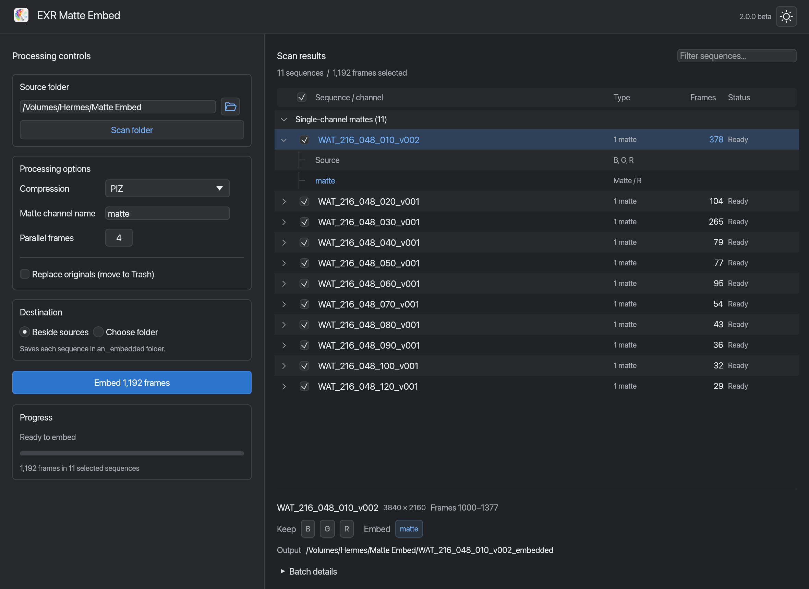

# EXR Matte Embed

A native Rust and egui desktop tool for embedding grading mattes into EXR delivery sequences. It keeps original image channels, including alpha, and adds named HALF channels from each matte’s red channel. No color conversion is performed.

The Rust application is **2.0.0 beta** on `rust-migration`. The complete Python/PySide **1.1.0** application remains permanently available on [python-1.1.0](https://github.com/jordan-steele/exr-matte-embed/tree/python-1.1.0). The existing release artwork remains on `main`.



## Delivery workflow

1. Choose or drop a folder containing source sequences and their `_matte*` sibling folders, then scan it.
2. Select the sequences to embed. Expand a sequence to see its source and matte channels; selecting a row shows its details and destination. Filtering matches sequence and matte folder names, and the header checkbox selects only visible ready sequences.
3. Choose compression, matte prefix, worker count, and destination. PIZ and four frame workers are the defaults (fewer on smaller machines).
4. Embed the batch. Progress, elapsed time, frame rate, and an estimate of remaining time appear below the processing controls. Stop stays visible at the bottom of that pane, finishes active frames, and leaves completed outputs in place.

For example:

```text
Deliveries/
  SHOT/              SHOT.0001000.exr, SHOT.0001001.exr, …
  SHOT_matte/        mask.1000.exr, mask.1001.exr, …
  SHOT_matteHero/    hero.1000.exr, hero.1001.exr, …
```

With prefix `DI_Matte`, these produce `DI_Matte` and `DI_Matte.hero` in `SHOT_embedded`. `_matteR`, `_matteG`, `_matteB`, and `_matteA` map to `DI_Matte.matte_r`, etc., so RGBA channels remain protected. Frame numbers are matched numerically; filename prefixes and padding may differ. Nested delivery folders are supported.

Outputs go beside sources in `*_embedded` folders or under a chosen destination root. Existing files are never overwritten. A saved JSON report records results and errors. Folder paths, compression, matte prefix, worker count, replacement preference, and light/dark appearance persist between sessions; the first launch imports the Python preferences when available.

**Replace originals via Trash** is available when outputs are beside sources. The desktop app asks for confirmation before starting that batch. Replacement starts only after every frame embeds successfully. Each completed sequence is published before originals and matte folders move to Trash. Failed publication restores the original source folder; failed Trash operations retain originals in a named backup folder and report its path. Stopped or failed embedding batches keep originals in place.

## Build and run

Use Rust **1.95 or later**. Python, Qt, and a separately installed OpenEXR library are not required to run the application.

```sh
cargo build --release --locked
cargo run --release --locked
```

On macOS, create a double-clickable app and ZIP:

```sh
scripts/package_macos.sh
```

The app is `target/EXR Matte Embed.app`; the CLI is `target/release/exr-matte-embed-cli`. The local app uses an ad-hoc signature. Public signing and notarization are separate release work. Windows and Linux use `target/release/exr-matte-embed` (with `.exe` on Windows). On Linux, GUI compilation requires OpenGL/window-system development packages and an available desktop/file-dialog portal. The CLI can be built independently:

```sh
cargo build --release --locked --no-default-features --bin exr-matte-embed-cli
target/release/exr-matte-embed-cli "/path/to/Deliveries" --scan-only
target/release/exr-matte-embed-cli "/path/to/Deliveries" --matte-channel DI_Matte
```

See [CLI_README.md](CLI_README.md) for CLI options. Jenkins builds native macOS Intel, Apple Silicon, and Windows beta artifacts using the existing agent labels; agents need Rust installed. It archives builds without publishing releases.

## EXR support and validation

The backend uses `johannesvollmer/exrs` (`exr` 1.74.2). It supports one flat scanline part with full-resolution channels. HALF, FLOAT, and UINT source channels and original attributes are retained. Source and matte data windows must match, including their origins. Deep, tiled, multipart, and subsampled images are rejected explicitly. The scanner checks the first frame’s headers; every processed frame receives the same full validation.

PIZ, ZIP, ZIPS, RLE, and uncompressed output preserve image samples. PXR24, B44/B44A, and DWAA/DWAB can change samples; the UI identifies those choices. PIZ is the validated default for these deliveries. The receiving post house’s own application should still receive an import check before production delivery.

```sh
cargo test --locked --all-targets
cargo clippy --locked --all-targets --all-features -- -D warnings
cargo fmt --all --check
```

The [benchmark](rust/BENCHMARK.md) compares the frozen Python processor and the Rust core on the supplied Centaur and Hermes sequences, plus generated RGBA fixtures. Rust’s four-worker configuration measured 1.31–1.43× the throughput of the fastest tested Python configuration on complete sequences. See [rust/README.md](rust/README.md) for independent OpenEXR pixel/metadata checks and benchmark reproduction.

Native macOS testing is documented in [rust/VALIDATION.md](rust/VALIDATION.md). Windows and Linux runtime behavior still requires testing on those platforms.

## License

[MIT](LICENSE).
