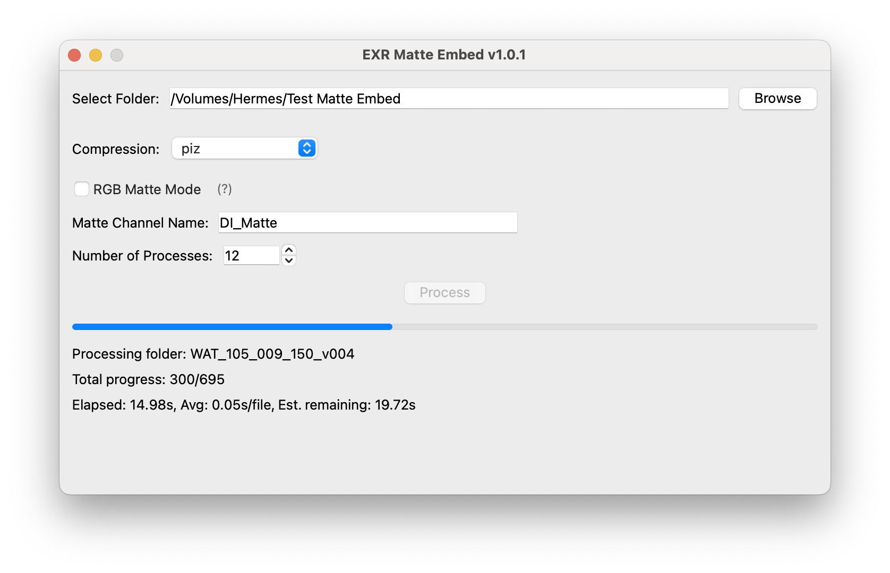

# EXR Matte Embed

A Python-based tool for batch embedding matte/mask sequences into EXR files. This tool allows you to automatically combine your base EXR sequences with corresponding matte sequences, embedding the mattes as additional channels within the original EXRs.

[]

## Features

- Batch process entire sequences of EXR files
- Support for both single-channel and RGBA matte embedding
- Configurable matte channel naming
- Multi-threaded processing for optimal performance
- Multiple compression options
- Progress tracking with time estimates
- Cross-platform support (Windows, macOS, Linux)

## Installation

### Download Release
The easiest way to get started is to download the pre-built application for your platform from the [Releases](https://github.com/yourusername/exr-matte-embed/releases) page:
- Windows: Download and run the `.exe` installer
- macOS: Download and mount the `.dmg` file, then drag the application to your Applications folder

### Build from Source
If you prefer to run from source:

1. Clone the repository:
   ```bash
   git clone https://github.com/yourusername/exr-matte-embed.git
   cd exr-matte-embed
   ```

2. Create and activate a virtual environment (recommended):
   ```bash
   # Windows
   python -m venv venv
   venv\Scripts\activate

   # macOS/Linux
   python3 -m venv venv
   source venv/bin/activate
   ```

3. Install dependencies:
   ```bash
   pip install -r requirements.txt
   ```

4. Run the application:
   ```bash
   python main.py
   ```

## macOS Security Notes

When running the application on macOS, you may encounter additional security measures since the application is not signed with an Apple Developer Certificate. To run the application:

Method 1:
1. Right-click (or Control-click) the application
2. Select "Open" from the context menu
3. Click "Open" in the security dialog that appears

Alternative method:
1. Navigate to System Settings > Privacy & Security
2. Locate the security message about the blocked application
3. Click "Open Anyway" to grant permission

Note: These security prompts are part of macOS's Gatekeeper protection system. As this is an open-source application, you can review all source code in this repository to verify its safety and functionality.

## Usage

### Basic Usage

1. Run the application:
   ```bash
   python main.py
   ```

2. Select your source folder containing the EXR sequences
3. Choose your compression settings
4. Click "Process" to begin embedding

### Folder Structure

The tool expects a specific folder structure for your sequences:

For single matte mode:
```
main_folder/
├── SHOW_100_010_020_v001/
│   ├── SHOW_100_010_020_v001.0001.exr
│   ├── SHOW_100_010_020_v001.0002.exr
│   └── ...
└── SHOW_100_010_020_v001_matte/
    ├── SHOW_100_010_020_v001_matte.0001.exr
    ├── SHOW_100_010_020_v001_matte.0002.exr
    └── ...
```

For RGB matte mode:
```
main_folder/
├── SHOW_100_010_020_v001/
│   ├── SHOW_100_010_020_v001.0001.exr
│   └── SHOW_100_010_020_v001.0002.exr
├── SHOW_100_010_020_v001_matteR/
│   ├── SHOW_100_010_020_v001_matteR.0001.exr
│   └── SHOW_100_010_020_v001_matteR.0002.exr
├── SHOW_100_010_020_v001_matteG/
├── SHOW_100_010_020_v001_matteB/
└── SHOW_100_010_020_v001_matteA/
```

Output will be created in a new `sequence1_embedded` folder.

### RGB Matte Mode

When enabled, RGB matte mode will look for four separate matte sequences with suffixes `_matteR`, `_matteG`, `_matteB`, and `_matteA`. Each matte will be embedded as a separate channel in the final EXR.

### Compression Options

Available compression methods:
- none: No compression
- rle: Run-length encoding
- zip: ZIP compression
- zips: ZIP compression with scanline prediction
- piz: Wavelet compression (default)
- pxr24: Lossy 24-bit float compression
- b44: Lossy 4x4 block compression
- b44a: B44 with alpha channel compression
- dwaa: DWAA compression

## License

Distributed under the MIT License. See `LICENSE` for more information.

## Acknowledgments

- [OpenEXR](https://github.com/AcademySoftwareFoundation/openexr) for the underlying EXR file handling
- Tkinter for the GUI framework